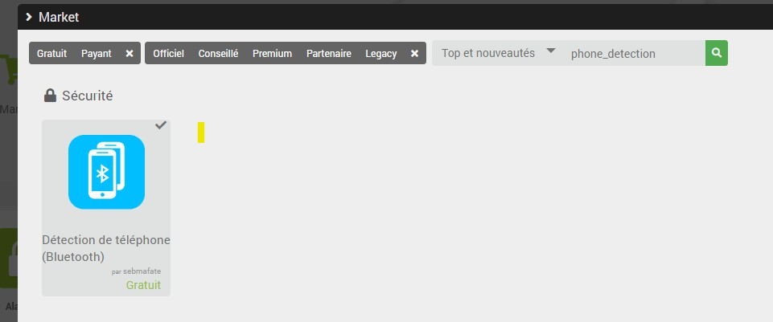
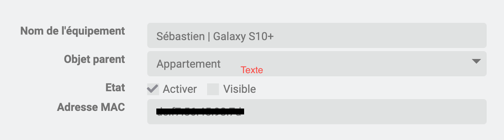

# Plugin phone_detection pour Jeedom

## 1. Description
Ce plugin est développé pour fonctionner avec Jeedom.

Il permet de détecter la présent d'un ou plusieurs téléphone en utilisant l'adresse MAC de la puce bluetooth.

## 2. Installation
Pour le moment, ce plugin n'est pas configuré dans le market Jeedom, j'attends qu'il soit stable avant de le publier. L'installation doit donc se faire manuellement.

### a. Installation via jeedom market
Jeedom permet d'installer facilement un plugin :

Pour cela dans le gestionnaire de plugins cliquez sur le bouton "Market"

Dans la fenêtre qui s'ouvre renseignez comme suit les informations :

### b. Installation via le code source
Il est aussi possible d'installer en utilisant le code source. Attention, cette manipulation est réservée à un public plutôt averti, vous pouvez en effet rendre votre jeedom instable.

- Dans une console (en ssh ou en local), rendez vous dans le répertoire /var/www/html/plugins
- Exécutez la commande suivante : `git clone https://github.com/sebmafate/phone_detection/ --branch develop`
- Voilà, c'est installé !

## 3. Configuration

- Lancez l'installation des dépendances
- Adaptez la configuration, enregistrez
- Lancez le démon

Allez dans l'écran "Plugins > Sécurité > Détection de téléphone (Bluetooth)" :
- Ajoutez un téléphone en cliquant sur le bouton +
- Puis donnez un nom à votre équipement et renseignez l'adresse MAC de la puce puce bluetooth de votre téléphone
- Enregistrez
- Patientez quelques secondes et le status de votre téléphone est mis à jour !

Voici un example de configuration :

